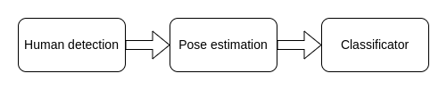
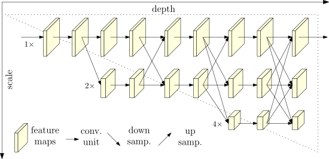
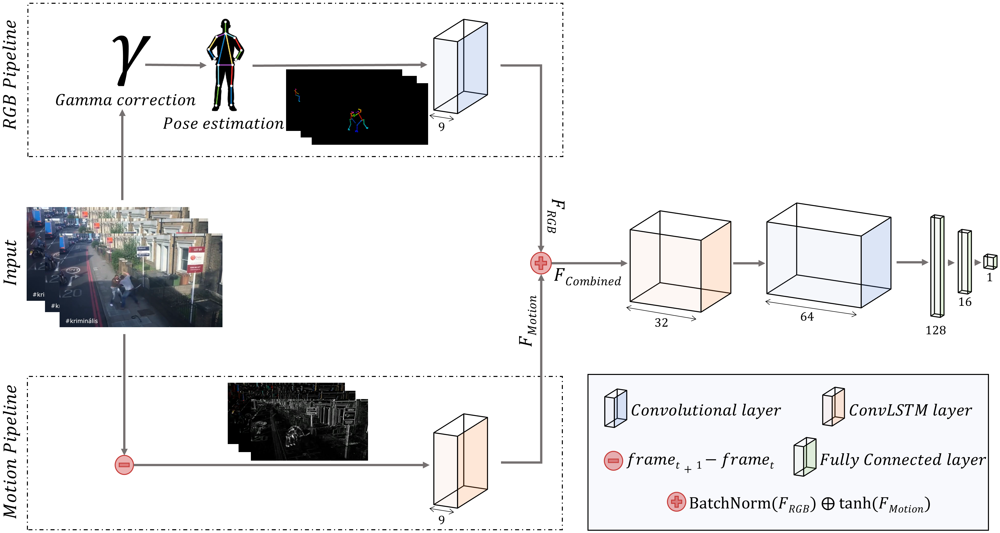

# Обнаружение насилия при наблюдении с помощью беспилотных летательных аппаратов

Этот проект предназначен для использования беспилотника с набором датчиков для обнаружения боев на определенной территории. Для обнаружения драк беспилотник использует камеру и алгоритмы компьютерного зрения, которые работают в два этапа.

## Описание задачи

Беспилотник должен пролететь по периметру территории и обнаружить людей, которые могут быть вовлечены в драку. 

## Архитектура решения

Решение основаннно на репозитории [MMActions2](https://github.com/open-mmlab/mmaction2) и состоит из нескольких ступеней. Сначала мы детектируем людей. Получив ббоксы нам необходимо найти позы людей на каждом кадре. Для этого строим скелет. Теперь используя скелеты на вход классификатора скелеты с нескольких кадров на выходе мы получаем является ли это действие насильственным.



Сам классификатор на базе скелетов может быть построен множеством способов. В нашей работе мы за основу взяли HRNET.



Плюсом данной архитектуры является то, что она не так сильно зависима от положения камеры в кадре и окружения вокруг. Так как вся работа с самим изображением заканчивается на этапе построения скелетов.

За счет этой особенности для обучения классификатора можно использовать как реальные данные, так и синтетически сгенерированные, при условии, что мы сможем построить по ним скелеты.

Для дообучения был взят датасет [RROSE NTU CCTV-Fights Dataset](https://rose1.ntu.edu.sg/dataset/cctvFights/download)


## Альтернативные рассмотренные решения

### CNN+RNN

Эта архитектура является одной из самых популярных подходов к решению данной проблемы, что является плюсом, так как существует множество примеров и датасетов, но все они для статичной камеры. Для дронов же датасетов мизерное количество, что приводит к проблеме их нехватки.

Так как в этой архитектуре мы обрабатываем само изображение нам нужем большой датасетс аугментациями при тренировке.

### [Violence-Detection-With-Human-Skeletons](https://github.com/atmguille/Violence-Detection-With-Human-Skeletons/tree/main)

Является нечто средним между первыми двумя решениями. Входное избображения преобразовывается в два других. Первое это отресованные скелеты без заднего фона. Второе это разница соседних кадров. Эти изображения пропускаются через сверточные слои и конкатинируются. Далее решение похоже на CNN+RNN. Из плюсов этого решения в сравнении с CNN+RNN можно выделить большую точность. Тем не менее проблемы все теже, небходим большой размеченный датасет с дрона.



## Ссылки на источники

```
@inproceedings{duan2022pyskl,
  title={Pyskl: Towards good practices for skeleton action recognition},
  author={Duan, Haodong and Wang, Jiaqi and Chen, Kai and Lin, Dahua},
  booktitle={Proceedings of the 30th ACM International Conference on Multimedia},
  pages={7351--7354},
  year={2022}
}
```